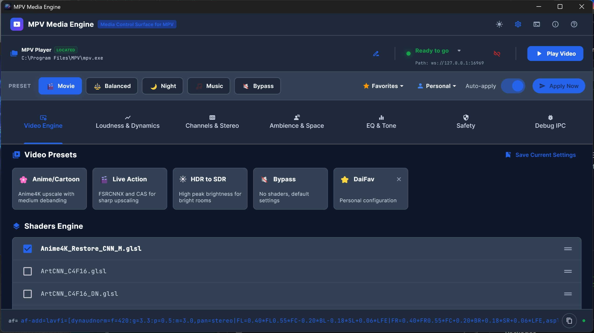
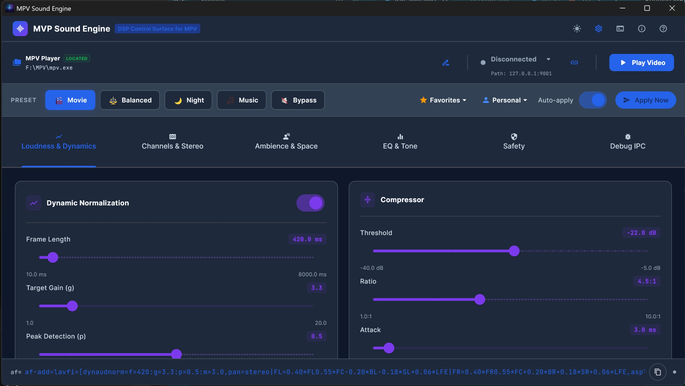
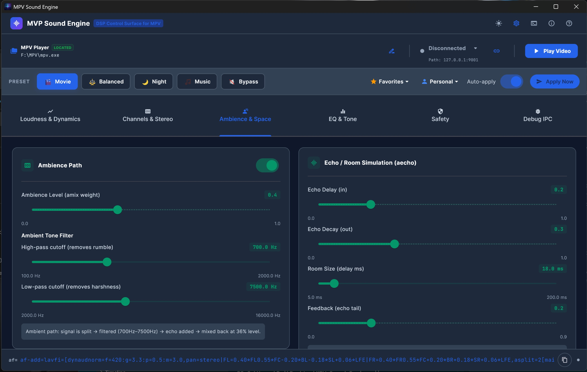
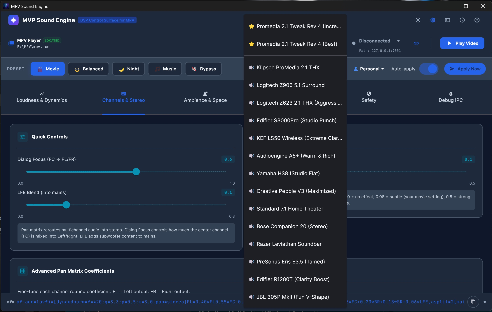
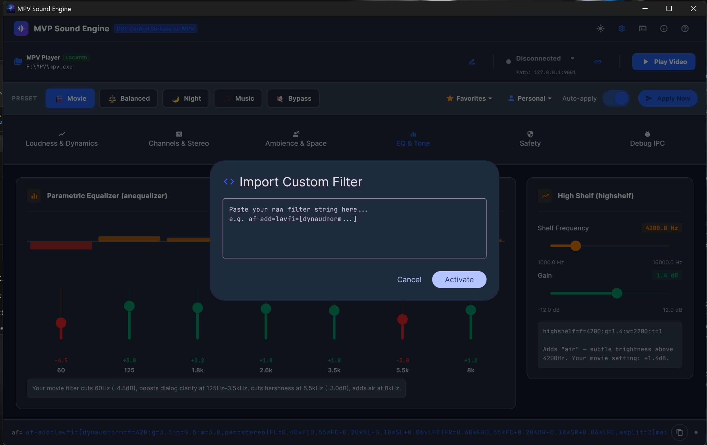

# MPV Media Engine 🎛️🎬

[](https://github.com/ddinh99/MPV-Media-Engine/releases/latest)
[](https://github.com/ddinh99/MPV-Media-Engine)
[](LICENSE)







A real-time external **master control surface**, **companion GUI**, and **graphic equalizer** built specifically for the **[MPV media player](https://mpv.io/)**. 

Normally, adjusting video shaders, scalers, or complex audio DSP filters (like dynamic range compression and parametric EQ) in MPV requires writing tedious commands in text config files. **MPV Media Engine** provides a beautiful, real-time control panel GUI that injects these changes directly into your active MPV instance over WebSockets/IPC without ever having to restart your video.

---

## 🔍 Why Use MPV Media Engine?

If you are looking for an **MPV GUI controller**, **MPV shader manager**, or **MPV audio equalizer app**, this tool bridges the gap by running as an external companion window (perfect for secondary screens or dual-monitor setups).

*   **Clean Video Window:** Keep your main screen 100% clean and borderless. No internal Lua overlay menus or clunky text overlays blocking your video.
*   **Zero-Configuration Shaders:** No more manually editing `input.conf` or typing complex `change-list glsl-shaders toggle` commands.
*   **Visual DSP Control:** See your parametric EQ curves interactively instead of guessing text values.

---

## ✨ Features & Capabilities

### 🎬 Real-Time Video Engine & Shader Manager
*   **Dynamic Shader Injection:** Easily inject, toggle, and reorder GLSL shaders (such as `Anime4K`, `FSRCNNX`, `CAS`, and `KrigBilateral`) on the fly.
*   **Resolution-Aware Shader Recommendations:** The application automatically reads your active video's height/width, groups compatible shaders into Low-Res vs. High-Res recommendations, and presents them in the optimal execution order (upscale → refine → chroma → sharpen).
*   **High Performance Temporal Interpolation:** Fine-tune motion interpolation for high-refresh-rate displays. Customize your `tscale` kernel (Spline64, Mitchell, Box) and windowing functions (Sphinx, Hann) for smooth, ghost-free panning.
*   **Fine-Grained Scaler Tuning:** Pick independent luma/chroma/downscale kernels (`scale`/`cscale`/`dscale`) and dial in `sharpen` and per-kernel antiringing strength to squeeze out ringing artifacts on your upscaled sources.
*   **HDR to SDR Tone Mapping:** Instantly cycle tone mapping algorithms (bt.2446a, mobius, spline) and push target peak brightness parameters to watch dark HDR movies in bright rooms.
*   **SDR to HDR Color Expansion:** Force target colorspace hints, primaries, gamuts, gamut-mapping modes, TRCs (like `bt.2020` or `pq`), and reference white level to map SDR content perfectly to high-end HDR monitors.
*   **Display-Aware Target Peak:** Reads your panel's real peak brightness (EDID via DXGI) and marks it directly on the Target Peak slider, warning when you push past it.
*   **Hardware Color Grading & Deband:** Adjust brightness, contrast, saturation, and dial in deband strength/range/grain to fix color banding on low-bitrate video dynamically.
*   **GPU Hardware Decoding:** One-click toggle offloads decoding to the GPU for much lower CPU usage on 4K HEVC/AV1 sources.
*   **Dither Controls:** Choose the dither algorithm (fruit/ordered/error-diffusion/off) and error-diffusion kernel used before output.
*   **One-Click Video Presets:** Pre-configured Best SDR / Best HDR pair (pick by whether Windows HDR is on), Anime/Cartoon, Live Action, HDR to SDR, Vivid, HDR Punch (full HDR passthrough + hottest grade), plus Gloss macro chips for quick saturation/contrast punch, and a dynamic "Bypass (Default)" button to instantly reset video configurations.

### 🎧 Live Sound Engine & Parametric Audio Equalizer
*   **7-Band Parametric EQ GUI:** A full graphic equalizer that updates instantly as you drag the sliders, displaying the exact frequency curve response.
*   **Dynamic Loudness Normalization (Night Mode):** Toggle the FFmpeg `DynAudNorm` filter to compress wide cinematic dynamic ranges. Hear whispered dialog clearly without getting deafened by explosions.
*   **Audiophile Profile Curves:** Quick-select target EQ curves for popular headphone/speaker brands (Sony, Bose, Sennheiser, Klipsch) and TV/soundbar setups.
*   **Spatial Up/Downmixing:** Dynamically control the MPV audio channel pan matrix to downmix 5.1/7.1 surround sound tracks to clear stereo.
*   **Per-Layout Channel Configs (Stereo / 5.1 / 7.1):** Switch the pan output layout on the fly from the Channels & Stereo tab. Each layout remembers its own pan matrix, and saved Favorites are tagged with the layout they were tuned for — no restrictions, so you can audition any preset on any speaker setup.

### ⚙️ Quality of Life & Architecture
*   **Persistent Sessions:** Remembers your exact equalizer bands, active shaders, and preset states across launches so you never have to reconfigure your player.
*   **Resilient IPC Connection:** Commands are funneled through a pace-regulated queue to prevent `mpv` or `libplacebo` from freezing under rapid slider updates. Supports automatic state synchronization if the player restarts.
*   **Debug IPC Console:** View the raw JSON Inter-Process Communication traffic (sent/received messages) between the GUI and MPV.
*   **Color Themes:** Switch between Dark, Teal, and Light theme modes.

---

## 🛠️ How It Works (Under the Hood)
The control panel is built using **Flutter**. It communicates with MPV's native JSON IPC (Inter-Process Communication) interface over named pipes (on Windows) through a fast, lightweight PowerShell websocket bridge. 

As you drag sliders, the app translates your inputs into raw MPV properties (like `glsl-shaders` or `tone-mapping`) and FFmpeg `lavfi` filter strings (like `af-add=lavfi=[...]`), injecting them instantly.

---

## 🚀 Getting Started

### Method A: Download the Executable (Recommended)
1. Go to the [**Latest GitHub Releases**](https://github.com/ddinh99/MPV-Media-Engine/releases/latest).
2. Download the `MPV_Media_Engine_vX.Y.Z.zip` file.
3. Extract the folder and run `MPV_Media_Engine.exe`. No Flutter development environment is required to use the app!

### Method B: Build from Source
#### Prerequisites
*   [Flutter SDK](https://docs.flutter.dev/get-started/install) installed and on your PATH.
*   Windows OS (currently optimized for Windows desktop).
*   A running instance of `mpv.exe` with IPC enabled.

1. Clone the repository:
   ```bash
   git clone https://github.com/ddinh99/MPV-Media-Engine.git
   cd MPV-Media-Engine
   ```
2. Run the cleanup and execution helper script:
   ```bash
   run_app.bat
   ```

---

## 💬 Frequently Asked Questions (FAQ) / Troubleshooting

#### How do I toggle MPV shaders in real-time?
Simply open MPV Media Engine alongside your player. Go to the **Shaders** tab, select the checkboxes of the GLSL shaders you want to apply, and they will immediately compile and run in the active video window.

#### How does the MPV audio equalizer work?
The app sends FFmpeg dynamic audio filter commands (`firequalizer`) through MPV's socket. Adjusting the 7-band sliders in the **Sound Engine** tab instantly redraws the parametric curves and adjusts the audio frequency output.

#### Can I use this as an alternative to MPV webUIs?
Yes! If you want a native, high-performance Windows desktop application to control your media player instead of opening a web browser tab, this functions as a complete local control surface.

---

## 💖 Support the Developer
If this companion tool has improved your movie-watching or audio-listening experience with MPV, consider supporting future development:

[](https://buymeacoffee.com/daidinh)
